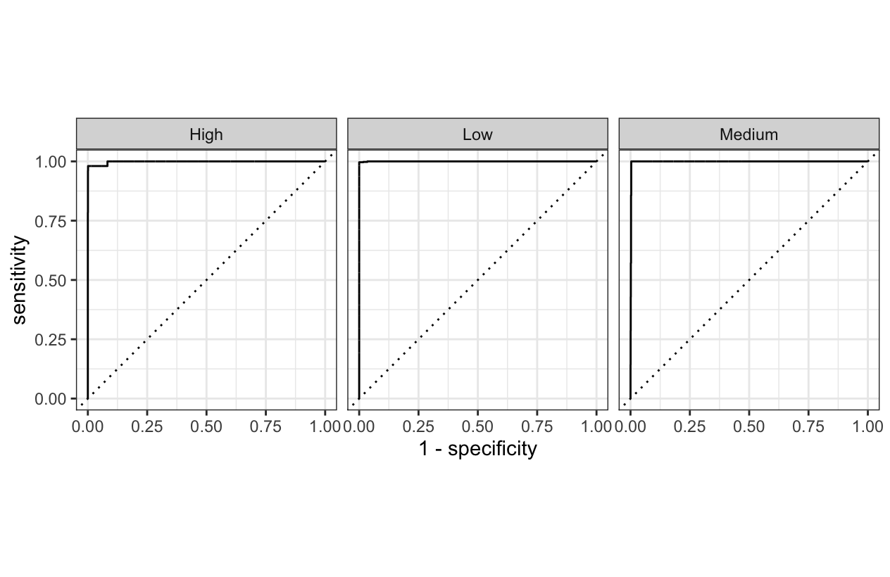
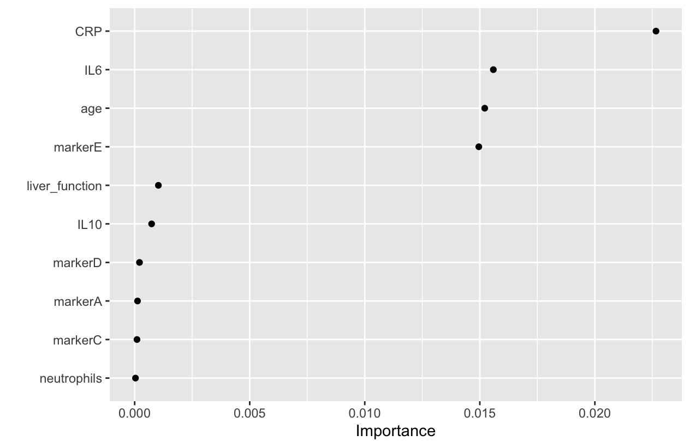

# Solution to Metastasis Risk Exercise

First of all we load the necessary libraries

```R
library(tidyverse)
library(tidymodels)
library(tidyclust)
library(GGally)
```

Then we load the data:

```R
metastasis_risk_data = readRDS(url("https://raw.githubusercontent.com/lescai-teaching/class-bigdata/main/L18_modelling_exercises/L18_dataset_metastasis_risk_data.rds"))
```

## Exploratory approach

we can get an overview of the data using plots of all possible combinations, but there are many variables in the dataset and using the following code might result in a quite difficult to read plot

```R
ggpairs(metastasis_risk_data, aes(colour = metastasis_risk))
```

We already know that *metastasis_risk* is our *outcome*: therefore we need to use a *supervised* model.
The outcome is a *categorical* variable, and therefore ours will be a *classification model*.


## Data Spending

As usual, first we need to split the data

```R
metastasis_risk_data_split = initial_split(metastasis_risk_data)
metastasis_risk_data_training = training(metastasis_risk_data_split)
metastasis_risk_data_testing = testing(metastasis_risk_data_split)
```

## Logistic Regression

In order to build a linear model for classification, we use logistic regression as follows:

```R
logreg_model <- logistic_reg() %>% 
  set_mode("classification") %>% 
  set_engine("glm")
```

Then we create our recipe by using all predictors, normalising the continuous one and encoding the categorical ones as numbers.
We add *step_zv()* to remove invariant values, should this be needed.

```R
logreg_recipe <- recipe(metastasis_risk ~ .,
                        data = metastasis_risk_data_training) %>% 
  step_zv() %>% 
  step_normalize(all_numeric_predictors()) %>% 
  step_dummy(all_nominal_predictors())
```

Once prepared the above, we can assemble our workflow


```R
logreg_wf <- workflow() %>% 
  add_recipe(logreg_recipe) %>% 
  add_model(logreg_model)
```

And fit the workflow we created as follows:

```R
logreg_wf_fit <- fit(
  logreg_wf,
  metastasis_risk_data_training
)
```

To inspect the predictions, we bind the predicted values to the original values of the testing dataset:

```R
logreg_wf_prediction <-
  bind_cols(
    metastasis_risk_data_testing,
    logreg_wf_fit %>% 
      predict(metastasis_risk_data_testing),
    logreg_wf_fit %>% 
      predict(metastasis_risk_data_testing, type = "prob")
  )
```

We can now inspect the basic metrics:

```R
logreg_wf_prediction %>% metrics(truth = metastasis_risk, estimate = .pred_class)

# A tibble: 2 × 3
  .metric  .estimator .estimate
  <chr>    <chr>          <dbl>
1 accuracy multiclass     0.968
2 kap      multiclass     0.183
```

And we can gather a better overview of the classifications by generating a confusion matrix.
This can be done either with a *table()* using basic R capabilities or with a *conf_mat()* function available from *tidymodels*.

```R
logreg_wf_prediction %>% 
  conf_mat(truth = metastasis_risk, estimate = .pred_class)

          Truth
Prediction  Low Medium High
    Low    2202      5   38
    Medium   16      2   13
    High      0      0    0
```
The above table shows that basically no values in the High Risk group have been predicted by our model: this explains why the accuracy in our metrics was not bad but in reality the Cohen's Kappa value was pretty low.

## Multinomial Logistic Regression

The real problem is that we used simple logistic regression for an outcome which we can see has three classes. This is not correct, and we should therefore switch to a multinomia logistic regression, by simply changing the model structure to

```R
multinomreg_model <- multinom_reg() %>% 
  set_mode("classification") %>% 
  set_engine("nnet")
```

We are using a *neural network* ("nnet") engine here, because the engine "glmnet" would require us to perform regularisation.

The rest of the code is pretty much the same

```R
multinomreg_recipe <- recipe(metastasis_risk ~ .,
                        data = metastasis_risk_data_training) %>% 
  step_zv() %>% 
  step_normalize(all_numeric_predictors()) %>% 
  step_dummy(all_nominal_predictors())

multinomreg_wf <- workflow() %>% 
  add_recipe(multinomreg_recipe) %>% 
  add_model(multinomreg_model)

multinomreg_wf_fit <- fit(
  multinomreg_wf,
  metastasis_risk_data_training
)


multinomreg_wf_prediction <-
  bind_cols(
    metastasis_risk_data_testing,
    multinomreg_wf_fit %>% 
      predict(metastasis_risk_data_testing),
    multinomreg_wf_fit %>% 
      predict(metastasis_risk_data_testing, type = "prob")
  )

```

This time though when we plot a confusion matrix we can see

```R
multinomreg_wf_prediction %>% 
+   conf_mat(truth = metastasis_risk, estimate = .pred_class)
          Truth
Prediction  Low Medium High
    Low    2180      6   33
    Medium    3      1    0
    High     25      2   26
```


## Random Forest model

We decide therefore to follow another approach, i.e. use a random forest for classification and we choose in the very beginning to use 2,000 trees and a minimum number of records = 20 in each node before splitting futher.

```R
rf_model <- rand_forest(
  trees = 2000,
  min_n = 20
) %>% 
  set_mode("classification") %>% 
  set_engine("ranger")
```

We can build the recipe on all predictors, and we assemble a feature engineering procedure similar to the one we used for the logistic regression:

```R
rf_recipe <- recipe(metastasis_risk ~ .,
                    data = metastasis_risk_data_training) %>% 
  step_zv() %>% 
  step_normalize(all_numeric_predictors()) %>% 
  step_dummy(all_nominal_predictors())
```

Now we can assemble this new workflow:

```R
rf_workflow <- workflow() %>% 
  add_recipe(rf_recipe) %>% 
  add_model(rf_model)
```

and fit the workflow as usual with the following code:

```R
rf_workflow_fit <-
  rf_workflow %>% 
  fit(metastasis_risk_data_training)
```

In order to inspect the predictions we can bind the predicted values to the testing data:

```R
rf_workflow_prediction <- bind_cols(
  metastasis_risk_data_testing,
  rf_workflow_fit %>% 
    predict(metastasis_risk_data_testing),
  rf_workflow_fit %>% 
    predict(metastasis_risk_data_testing, type = "prob")
)
```

We can create a ROC curve from this dataset, indicating the probability of prediction for all possible categories, which will be looped on in order to create the plot:

```R
rf_workflow_prediction %>% 
  roc_curve(metastasis_risk, .pred_Low, .pred_Medium, .pred_High) %>% 
  autoplot()
```

Obtaining this figure




We can also inspect the metrics:

```R
rf_workflow_prediction %>% 
  metrics(truth = metastasis_risk, estimate = .pred_class)

# A tibble: 2 × 3
  .metric  .estimator .estimate
  <chr>    <chr>          <dbl>
1 accuracy multiclass     0.995
2 kap      multiclass     0.883
```


Now the accuracy hasn't changed much, but the Cohen's Kappa coefficient has improved significantly.

We can check the single metrics as below:

```R
rf_workflow_prediction %>% 
  precision(truth = metastasis_risk, estimate = .pred_class)

rf_workflow_prediction %>% 
  recall(truth = metastasis_risk, estimate = .pred_class)

rf_workflow_prediction %>% 
  f_meas(truth = metastasis_risk, estimate = .pred_class)
```


And if we inspect the confusion matrix:

```R
rf_workflow_prediction %>% 
  conf_mat(truth = metastasis_risk, estimate = .pred_class)

          Truth
Prediction  Low Medium High
    Low    2218      6    5
    Medium    0      0    0
    High      0      1   46

```

We can now see that, although not perfect, the majority of individuals in the High Risk group have actually been predicted as High Risk this time.


## Factor influencing metastasis risk

In order to identify the factor that most influence the metastasis risk, we should get the original random forest model we created, and fit it on an identical formula but setting the importance to *permutation*

```R
library(vip)
rf_model %>%
  set_engine("ranger", importance = "permutation") %>%
  fit(
    metastasis_risk ~ .,
    data = metastasis_risk_data_testing
  ) %>%
  vip(geom = "point")
```

Which results in the following figure:



The top two predictors are *CRP* and *IL6* which are both strong indicators of **inflammation**.
We could therefore hypothesise that *inflammation* is actually the most important biological response which might affect the risk for metastasis in our individuals.