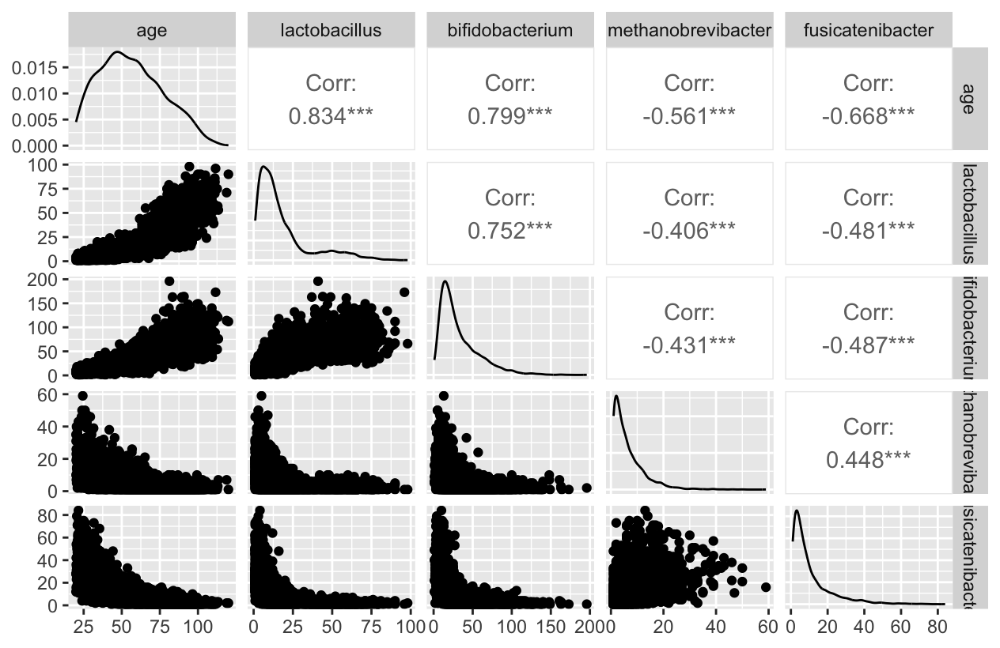
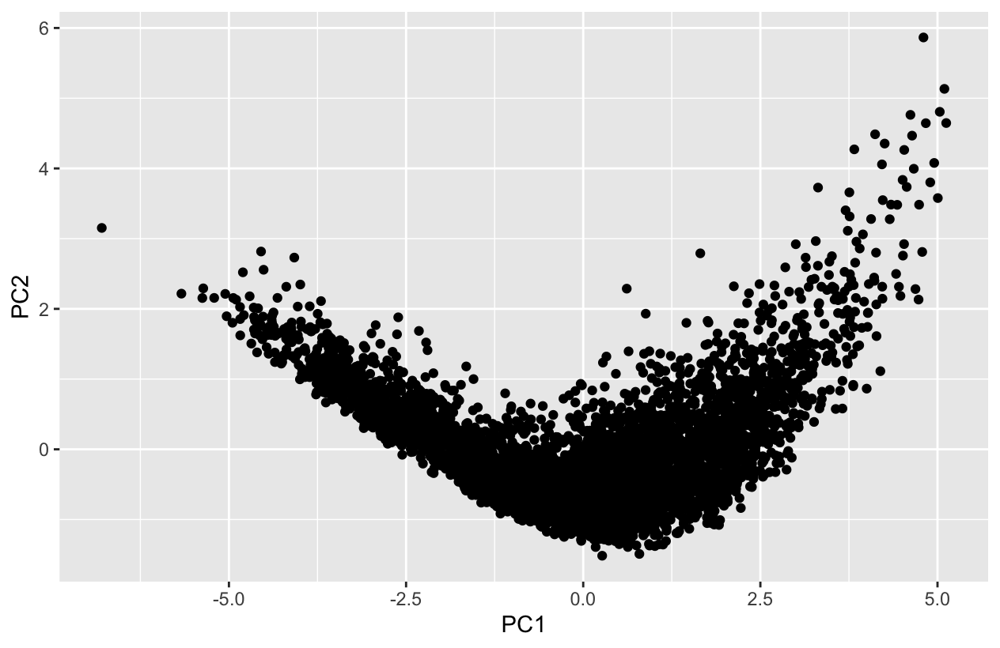
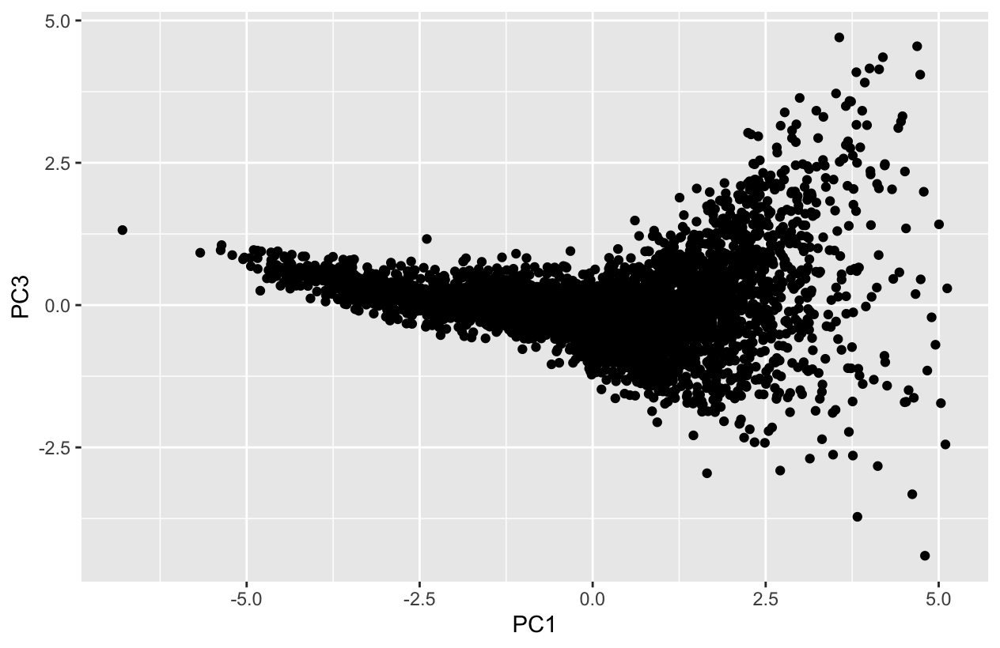
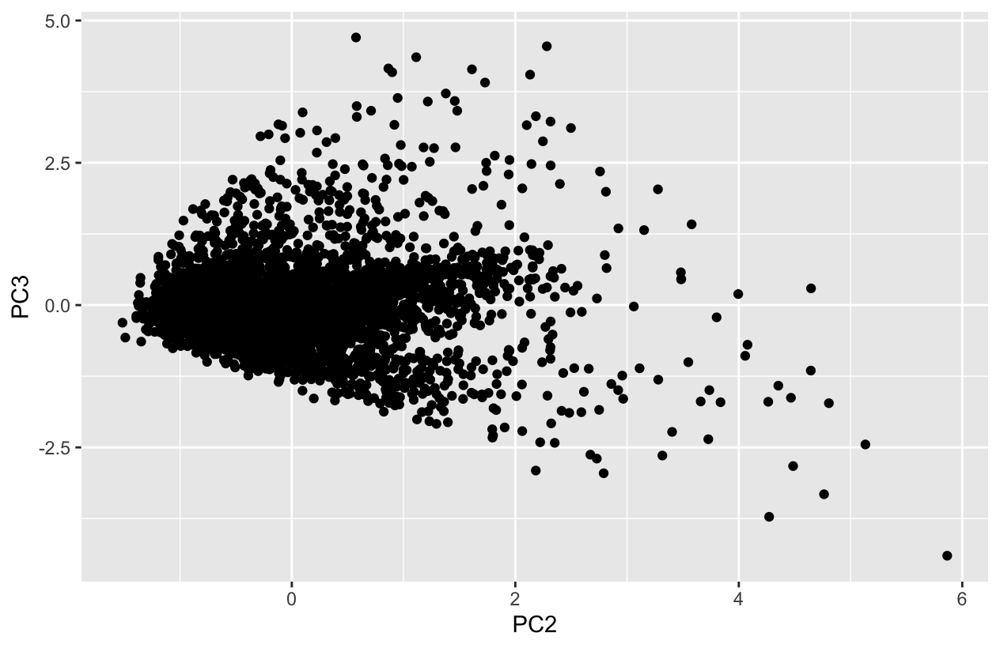
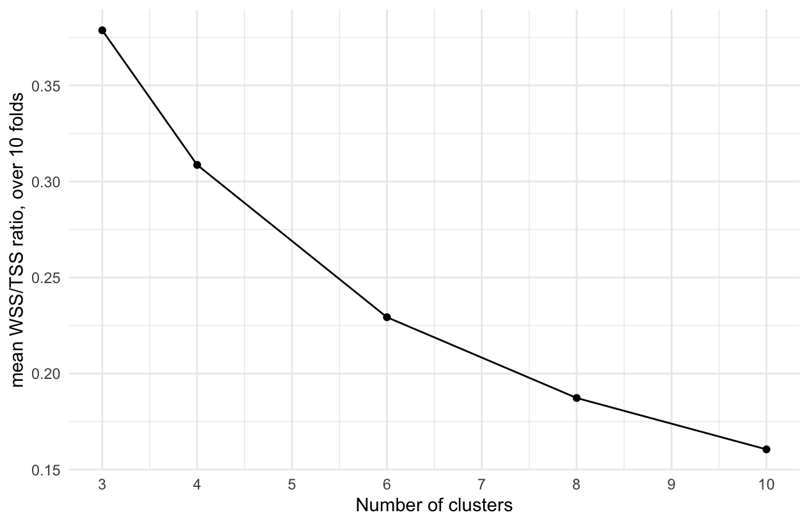
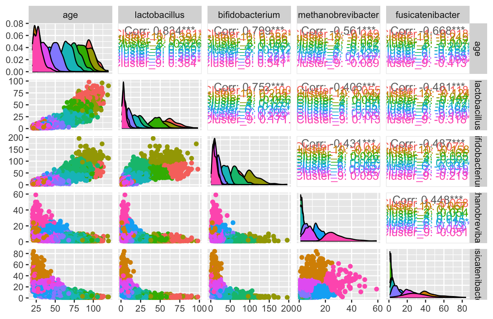

# Solution to Microbiome Exercise


## Data loading and exploration

To load the data we use:

```R
dataMicrobiome = readRDS(url("https://raw.githubusercontent.com/lescai-teaching/class-bigdata/main/L18_modelling_exercises/L18_dataset_dataMicrobiome.rds"))
```
Since the dataset is not very large, we can start exploring the content by using *ggpairs*.

```R
library(GGally)
ggpairs(dataMicrobiome)
```

Which results in the following picture:



There seems to be some correlation (a significant one) among all variables in the dataset, although with a substantial amount of noise.
We do not have any strong reason for performing a feature selection and excluding any one variable in particular.

For this reason, it might be worth inspecting the variance of our dataset and check if any structure appears in the data which we cannot identify with a pairs plot.

We will do this by running a PCA as follows:

```R
pca_recipe <- recipe(~., 
                     data = dataMicrobiome)
pca_transformation <- pca_recipe %>% 
  step_normalize(all_numeric()) %>% 
  step_pca(all_numeric(), num_comp = 3)
```

We then run the PCA using the *prep* function on the recipe we just created

```R
pca_estimates <- prep(
  pca_transformation,
  training = dataMicrobiome)
```

and then we extract the principal component associated to the original records in our dataset with:

```R
pca_data <- bake(
  pca_estimates,
  dataMicrobiome)
```

This allows us to plot the first two principal components

```R
ggplot(pca_data,
       aes(x=PC1, y=PC2))+
  geom_point()
```

we can see in this plot



that besides the appearence of a polynomial relationship between PC1 and PC2, we cannot identify any particular structure in the data.

To be sure we inspect also the other combinations


```R
ggplot(pca_data,
       aes(x=PC1, y=PC3))+
  geom_point()
```

which results in



and the next one

```R
ggplot(pca_data,
       aes(x=PC2, y=PC3))+
  geom_point()
```
which results in



We do not have any indication to use the PCA as a way to facilitate this analysis or to filter the data at this stage. 

Since we do not have a clear indication on the presence of an outcome variable in our dataset, we should use an *unsupervised* modelling approach.
We therefore perform a k-means clustering.

## K-means Clustering

The main problem, given the structure of the data, is that we cannot really guess the number of clusters we should expect.

It is therefore difficult to identify the starting number of centroids needed for the k-means clustering.

In order to approach this challenge, we therefore use tuning on the *num_cluster* parameter, as seen for the classification with random forest:

```R
k_means_model_tuning <- k_means(
  num_clusters = tune()
) %>% 
  set_engine("stats") %>% 
  set_mode("partition")
```

The next thing we need, is a range of values to tune on. Instead of using the default (which starts from 1), I chose to use an interval between 3 and 10, and then pick 5 different values in this interval.

```R
k_means_tune_clusters = grid_regular(
  num_clusters(range = c(3L,10L)),
  levels = 5
)
```

The result is:

```R
k_means_tune_clusters
# A tibble: 5 × 1
  num_clusters
         <int>
1            3
2            4
3            6
4            8
5           10
```

We then need a recipe, and it is quite important here to normalise the data, given the wide range of values among the different predictors

```R
k_means_model_tuning_recipe <- recipe(~., data = dataMicrobiome) %>% 
  step_normalize(all_numeric_predictors())
```

With this recipe in, we can build the workflow as usual (this is different from the setup for a classification)

```R
k_means_model_tuning_wf = workflow() %>% 
  add_model(k_means_model_tuning) %>% 
  add_recipe(k_means_model_tuning_recipe)
```

We create the combinations of cross-fold validation for the tuning, except that in this case we can do it on the whole dataset.

```R
dataMicrobiome_folds = vfold_cv(dataMicrobiome)
```

Now we can use a function that's specific for tuning a clustering model, which is called *tune_cluster*, and has a syntax very similar to other tuning approaches:

```R
microbiome_k_means_tune_fit <- tune_cluster(
  k_means_model_tuning_wf,
  resamples = dataMicrobiome_folds,
  grid = k_means_tune_clusters,
  control = control_grid(save_pred = TRUE, extract = identity),
  metrics = cluster_metric_set(sse_within_total, sse_total, sse_ratio)
)
```

After a few minutes we can collect the metrics

```R
microbiome_k_means_metrics <- microbiome_k_means_tune_fit %>% collect_metrics()
```

And use the dataset to plot the metrics as a function of the number of clusters in the k-means algorithm:


```R
microbiome_k_means_metrics %>%
  filter(.metric == "sse_ratio") %>%
  ggplot(aes(x = num_clusters, y = mean)) +
  geom_point() +
  geom_line() +
  theme_minimal() +
  ylab("mean WSS/TSS ratio, over 10 folds") +
  xlab("Number of clusters") +
  scale_x_continuous(breaks = 1:10)
```

Clearly in the figure



there is no single drop with stabilisation of the value and it looks like the improvement continues the more clusters are chosen

We can select the best params based on this:

```R
microbiome_k_means_best_params = microbiome_k_means_tune_fit %>%
  select_best("sse_ratio")
```

we cannot finalise a clustering model in the same way we do for a prediction model (functions are different)
thus, we just print the parameters and setup a new model with those


```R
k_means_model_selected <- k_means(
  num_clusters = 10
) %>% 
  set_engine("stats") %>% 
  set_mode("partition")
```

We build a new workflow with those

```R
k_means_model_selected_wf = workflow() %>% 
  add_model(k_means_model_selected) %>% 
  add_recipe(k_means_model_tuning_recipe)
```

fit the data as usual

```R
k_means_model_selected_fit = k_means_model_selected_wf %>% 
  fit(dataMicrobiome)
```
and combine the predictions with the original dataset


```R
clustered_microbiome = k_means_model_selected_fit %>%
  augment(dataMicrobiome)
```

In order to visually inspect the clustering on the original dataset visualisation:

```R
ggpairs(clustered_microbiome, columns = 1:5, aes(colour = .pred_cluster))
```

Which results in:

